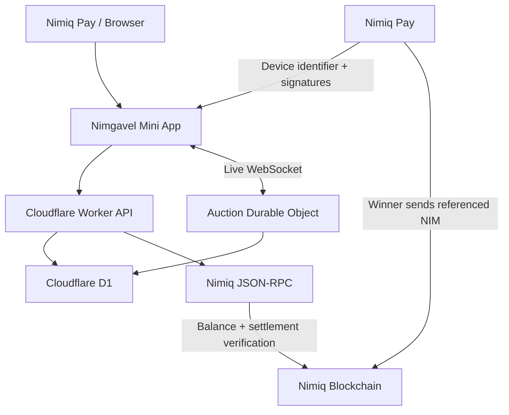

<p align="center">
  <a href="https://nimgavel.artistic-chip.workers.dev">
    
  </a>
</p>

<h1 align="center">Nimgavel</h1>

<h3 align="center">Going once. Going twice. NIM.</h3>

<p align="center">
  Live community auctions built natively for Nimiq Pay.
</p>

<p align="center">
  <a href="https://github.com/mystiquemide/nimgavel/actions/workflows/ci.yml">
    
  </a>
  <a href="https://nimgavel.artistic-chip.workers.dev">
    
  </a>
  <a href="https://www.nimiq.com/nimiq-pay">
    
  </a>
</p>

<p align="center">
  <a href="https://www.nimiq.com">
    
  </a>
  <a href="https://www.nimiq.com">
    
  </a>
  <a href="https://miniappscompetition.com">
    
  </a>
  <a href="./LICENSE">
    
  </a>
</p>

<p align="center">
  <a href="https://nimgavel.artistic-chip.workers.dev"><strong>Launch Nimgavel</strong></a>
  &nbsp;&nbsp;•&nbsp;&nbsp;
  <a href="https://nimgavel.artistic-chip.workers.dev/lobby">Auction Floor</a>
  &nbsp;&nbsp;•&nbsp;&nbsp;
  <a href="https://nimgavel.artistic-chip.workers.dev/how-it-works">How It Works</a>
  &nbsp;&nbsp;•&nbsp;&nbsp;
  <a href="https://nimgavel.artistic-chip.workers.dev/results">Results</a>
  &nbsp;&nbsp;•&nbsp;&nbsp;
  <a href="https://nimgavel.artistic-chip.workers.dev/leaderboard">Leaderboard</a>
</p>

<p align="center">
  <a href="https://nimgavel.artistic-chip.workers.dev">
    
  </a>
</p>

---

## Community auctions are easy to start but difficult to run fairly

**LIVE** — Nimgavel is a live community auction house built inside **Nimiq Pay**.

Chat auctions are simple until several people start bidding at once. Then bid ordering becomes unclear, closing times can be disputed, last-second sniping becomes frustrating, withdrawn bids can destroy the audit trail, and payment proof becomes difficult to verify.

Nimgavel gives the auction one authoritative live room and one complete loop:

```text
create → bid → soft close → sell → pay → verify
```

**LIVE** — No marketplace account. No platform custody. No platform transaction fee.

**LIVE** — Nimiq Pay handles wallet identity, signatures and the winner payment. Nimgavel handles the auction engine and verifies the resulting NIM settlement against Nimiq mainnet.

## Status legend

Every product claim in this README is marked with one of these states.

| Label | Meaning |
| --- | --- |
| **LIVE** | Running in the deployed Nimgavel product |
| **TESTED** | Covered by automated or real-device testing |
| **RECORDED** | Captured as user or judge evidence |
| **PLANNED** | Explicitly on the product roadmap |
| **PENDING PROOF** | Built or tested, but final submission evidence still needs packaging |

## Try Nimgavel

**LIVE** — Production: https://nimgavel.artistic-chip.workers.dev

**LIVE** — Network: Nimiq mainnet.

**LIVE** — Settlement asset: native NIM.

**LIVE** — Built for the Nimiq Pay Mini Apps Competition, Cycle II.

**PENDING PROOF** — The repository is currently private. Judge repository access must be granted as part of the final submission package.

## One complete auction loop

### 1. Create

**LIVE** — A host creates a lot with an item title, photograph, description, starting bid, minimum increment, duration and fulfillment terms.

**LIVE** — Hosts are prompted to publish the delivery or collection method, location/service-area context, expected timeframe, shipping responsibility or cost, and handoff details without exposing a private home address.

**LIVE** — Auction creation requires a Nimiq Pay wallet signature. There is no separate Nimgavel username or password.

### 2. Bid

**LIVE** — Bidders enter through Nimiq Pay and receive a pseudonymous paddle identity such as:

```text
Paddle #42 · Quiet Heron
```

**LIVE** — Paddle identity uses the Nimiq Pay Mini App device identifier flow rather than a separate marketplace account.

**LIVE** — Before the first bid, the bidder must acknowledge the host's published fulfillment terms.

**LIVE** — The first bid requires a Nimiq Pay wallet authorization signature. Nimgavel keeps a bounded set of NIM addresses shared by Nimiq Pay, binds that account set into the signed bidder proof, and checks those accounts individually on Nimiq mainnet. One account must independently cover the proposed bid; balances are never summed across accounts.

**LIVE** — Funds remain in the bidder's wallet until settlement. The balance check is an access guard, not a lock or escrow.

**RECORDED** — One earlier mainnet user who hit a false balance failure used the flow again after a fix and confirmed it worked. A later independent mobile user still reported a `0 NIM` block, so cross-device and multi-account validation remains open.

**PENDING PROOF** — Verify the current multi-account balance path again with the users who reported false `0 NIM` before treating the balance gate as fully validated on real devices.

### 3. Soft close

**LIVE** — A valid bid during the final 30 seconds resets the remaining time to 30 seconds.

**LIVE** — The server owns the authoritative deadline, so a stale client cannot force a late bid through after the room has closed.

**TESTED** — Soft-close behavior is covered by the auction-room test suite.

**PENDING PROOF** — Add a clean two-device soft-close recording to the final judge bundle.

### 4. Sell

**LIVE** — When the timer expires, the highest valid bid wins and the winning bid becomes locked.

**LIVE** — A lot with no qualifying bids automatically becomes `passed`. The host does not need to manually expire it.

**LIVE** — Bidders can withdraw eligible bids, hosts can remove bids only with a public reason, and removed bids remain visible in public history.

**TESTED** — Bid withdrawal/removal behavior and winner locking are covered by automated tests.

**PENDING PROOF** — Add a clean bid-removal recording to the final judge bundle.

### 5. Pay

**LIVE** — Only the winning bidder receives the settlement action.

**LIVE** — Nimiq Pay sends the exact winning amount directly from the winner's wallet to the host's wallet. Nimgavel never receives or holds the funds.

**LIVE** — The payment includes an auction-specific `Nimgavel:<lotId>` reference.

**LIVE** — Explicit wallet cancellation safely returns the winner to the payment flow, while uncertain outcomes stay in recovery mode to reduce double-payment risk.

### 6. Verify

**LIVE** — A transaction hash alone is not accepted as proof.

Nimgavel checks the submitted settlement against the auction, including:

- **LIVE** — Nimiq network
- **LIVE** — recipient
- **LIVE** — exact amount
- **LIVE** — auction reference
- **LIVE** — successful execution
- **LIVE** — required confirmation state

**LIVE** — Settlement moves through explicit `pending`, `verified` or `rejected` states, and pending evidence is rechecked automatically.

**PENDING PROOF** — One genuine verified mainnet NIM settlement should be the centerpiece of the final judge evidence bundle.

## Nimiq Pay is load-bearing

Nimiq Pay is not a checkout button attached to the end of Nimgavel. It is required throughout the auction lifecycle.

| Scene | Nimiq role | Status |
| --- | --- | --- |
| Host signature | Nimiq Pay signs the host authorization used to create/control the lot | **LIVE** |
| Paddle identity | Nimiq Pay's Mini App device identifier produces the device-scoped identity used to issue a pseudonymous paddle | **LIVE** |
| Bidder access | Nimiq Pay shares the user's NIM account set and signs the first-bid authorization; Nimgavel checks the signed account set on-chain before admitting the bid | **LIVE / PENDING PROOF** |
| Winner payment | Nimiq Pay signs and sends the native NIM payment directly to the host with the auction reference | **LIVE** |
| Settlement verification | The Nimiq Pay payment creates the referenced transaction; Nimgavel then verifies it against Nimiq mainnet via JSON-RPC | **LIVE** |

**LIVE** — Nimgavel never receives the user's private key.

## Fair auction mechanics

### Ordered bidding

**LIVE** — Each auction has one authoritative live room responsible for the current leader, amount, deadline and bid order.

### Balance-backed bidding

**LIVE** — A bidder cannot raise the auction price unless at least one NIM address shared by Nimiq Pay has enough NIM for the proposed bid at that moment.

**LIVE** — Shared accounts are checked individually. Nimgavel does not combine several smaller balances to satisfy one bid.

**LIVE** — The balance is not locked. The check prevents zero-balance price inflation but does not guarantee that funds remain available until settlement.

**PENDING PROOF** — Automated coverage is green, but real-device validation remains open for the Nimiq Pay account configurations that produced false `0 NIM` reports during live use.

### Minimum increments

**LIVE** — Every bid must satisfy the host's configured minimum increment.

### Server-authoritative deadlines

**LIVE** — The server decides whether bidding is still open.

### Transparent removals

**LIVE** — Withdrawn and host-removed bids remain in history rather than disappearing silently.

**LIVE** — If the current leader is removed, the room recalculates the valid leader and preserves response time for remaining bidders.

### Locked winner

**LIVE** — The winning bid cannot be withdrawn after the gavel falls.

## Judge-ready proof bundle

The final submission should let a judge inspect every important claim without reading the entire codebase.

| Evidence | Status |
| --- | --- |
| Live production URL | **LIVE** |
| Private repository + judge access | **PENDING PROOF** |
| Architecture diagram and architecture document | **LIVE** |
| Automated test suite | **TESTED** |
| CI workflow on `main` | **TESTED** |
| Two-device live auction recording | **PENDING PROOF** |
| Soft-close recording | **PENDING PROOF** |
| Bid-removal recording | **PENDING PROOF** |
| Multi-account funded-wallet verification on real devices | **PENDING PROOF** |
| One genuine verified mainnet NIM payment | **PENDING PROOF** |
| Real-user evidence | **RECORDED** |

The strongest judge story is one full loop:

```text
host signs
   ↓
bidder gets a paddle
   ↓
bidder authorizes the shared NIM account set
   ↓
live bidding
   ↓
soft close
   ↓
winner selected
   ↓
winner pays in Nimiq Pay
   ↓
Nimgavel verifies settlement
```

## Architecture



**LIVE** — Frontend: Vanilla JavaScript + Vite.

**LIVE** — API/runtime: Cloudflare Workers.

**LIVE** — Real-time auction engine: Cloudflare Durable Objects + WebSockets.

**LIVE** — Persistence: Cloudflare D1.

**LIVE** — Wallet integration: `@nimiq/mini-app-sdk`.

**LIVE** — Transaction parsing: `@nimiq/core`.

**LIVE** — No custom smart contract and no Nimgavel custodial payment wallet.

See [`docs/ARCHITECTURE.md`](docs/ARCHITECTURE.md) for the deeper protocol and API model.

## Product surfaces

| Surface | What it does | Status |
| --- | --- | --- |
| Home | Introduces Nimgavel and directs users into the auction flow | **LIVE** |
| Auction Floor | Browse live, upcoming and completed lots | **LIVE** |
| Auction Room | Timer, leader, bids, removals, fulfillment and settlement | **LIVE** |
| Host | Create and control an auction | **LIVE** |
| Results Ledger | Completed auctions and settlement state | **LIVE** |
| Leaderboard | Auction activity and winning history | **LIVE** |
| How It Works | Auction lifecycle and trust boundaries | **LIVE** |
| Privacy & Terms | Product responsibilities and limitations | **LIVE** |

**LIVE** — A normal browser can browse and spectate. Hosting, authenticated bidding and wallet settlement are intentionally handled inside Nimiq Pay.

## Used by early users on Nimiq mainnet

**RECORDED** — Early users have created auction rooms, joined auctions on mobile, connected Nimiq Pay, navigated the product and exercised the mainnet flow. Some users successfully placed bids, while balance-backed bidder access is still being verified across different Nimiq Pay account configurations.

The labels below represent separate users and usage sessions. Names and handles are withheld from the public README.

> “The UI is smooth, there’s a beginner guide, and it’s so easy to navigate.”  
> — **User 1 · Mobile mainnet user**

> “Bidding on an open auction item was seamless.”  
> — **User 2 · Auction participant**

> “Basically, your own mini auction house, powered by Nimiq.”  
> — **User 3 · First-time Nimgavel user**

> “Overall user experience on mobile was okay. I didn’t need an explainer to understand.”  
> — **User 4 · Mobile Nimiq Pay user**

**RECORDED** — A separate user rated their experience **95.9/100**, specifically praising the UI, brand consistency and working navigation. This is one user's rating, not an aggregate product score.

## User feedback changed the product

| User feedback | What changed | Status |
| --- | --- | --- |
| Wallet connection could take too long or require a refresh | Added bounded provider/account states, late-provider recovery and a retry path | **LIVE** |
| A funded mainnet wallet was incorrectly read as having 0 NIM | Corrected mainnet handling, hardened RPC parsing/retries, and moved bidder proof from a single assumed address to the bounded account set shared by Nimiq Pay | **LIVE / PENDING PROOF** |
| One affected user tried the flow again after an earlier fix | User confirmed the flow worked | **RECORDED** |
| Another independent mobile user could host successfully but was blocked from bidding by a `0 NIM` result | Multi-account bidder proof is deployed and CI is green; the affected real-device configurations still need current-build verification | **PENDING PROOF** |
| Mobile users said the core site was understandable without an explainer | Kept onboarding lightweight and preserved the direct create/bid/settle navigation model | **RECORDED** |
| Winner cancellation could leave payment recovery in a confusing state | Normalized explicit cancellation and preserved safe unknown-payment recovery | **LIVE** |
| Auction Floor / Results were slow on mobile | Removed embedded base64 photos from list responses and serve lot images separately through cacheable image endpoints | **LIVE** |
| Recent hammer results moved while someone was still reading them | Reduced disruptive refresh behavior and only rebuild the section when the result data actually changes | **LIVE** |
| Users asked what happens when nobody bids | Clarified that the auction closes automatically as `passed` | **LIVE** |
| Buyers wanted delivery/collection expectations before bidding | Hosts publish fulfillment terms and bidders must acknowledge them before the first bid | **LIVE** |
| Buyers asked for Amazon-like delivery assurance | Clarified that Nimgavel verifies auction/payment evidence but does not currently guarantee real-world delivery | **LIVE** |
| Buyers asked how to complain about late or missing delivery | Added the structured post-auction complaint/dispute workflow to the roadmap | **PLANNED** |

**RECORDED** — Product changes above came from actual user feedback and live usage rather than only scripted demos or local fixtures.

## Current trust boundary

Nimgavel can prove substantially more about the auction and NIM payment than it can currently prove about physical-world delivery.

### What Nimgavel currently establishes

- **LIVE** — authoritative auction state
- **LIVE** — bid and removal history
- **LIVE** — winning paddle
- **LIVE** — published fulfillment terms
- **LIVE** — bidder acknowledgement of those terms
- **LIVE** — balance gate at bid time
- **LIVE** — matching NIM settlement evidence

**PENDING PROOF** — The balance gate is deployed and covered by automated tests, but real-device validation is still open for the Nimiq Pay account layouts that produced false `0 NIM` reports.

### What Nimgavel does not currently guarantee

- **LIVE** — Nimgavel does not custody buyer or seller funds
- **LIVE** — Nimgavel does not lock bidder funds between bidding and settlement
- **LIVE** — Nimgavel does not guarantee physical delivery
- **LIVE** — Nimgavel does not authenticate physical items
- **LIVE** — Nimgavel does not provide escrow
- **LIVE** — Nimgavel does not currently arbitrate delivery disputes
- **LIVE** — Nimgavel does not guarantee the real-world identity of a bidder or seller

A verified NIM payment proves that the matching payment occurred under the configured RPC trust assumption. It does not prove that a seller later delivered an item or that a physical item is authentic.

## Roadmap

The next product work focuses on making repeat auctions dependable and strengthening the settlement-to-delivery lifecycle.

### Near term

- **PLANNED** — wallet-signed host-control recovery
- **PLANNED** — cancellation for auctions that have not started
- **PLANNED** — explicit unpaid-winner state and settlement window
- **PLANNED** — stronger native-device coverage and monitoring

### Fulfillment and complaints

- **PLANNED** — private host/winner coordination after verified settlement
- **PLANNED** — immutable snapshot of the exact fulfillment terms accepted by the winner
- **PLANNED** — awaiting fulfillment / shipped / ready for pickup / delivered states
- **PLANNED** — optional tracking references
- **PLANNED** — winner delivery confirmation
- **PLANNED** — complaints for late, missing, wrong or damaged delivery
- **PLANNED** — host responses and immutable complaint history
- **PLANNED** — opened / responded / resolved / unresolved complaint states
- **PLANNED** — privacy-safe evidence and downloadable records

### Stronger settlement protection

- **PLANNED** — evaluate refundable bid bonds
- **PLANNED** — evaluate stronger wallet payment commitments
- **PLANNED** — evaluate escrow or HTLC-style settlement only after dedicated protocol, failure-state and security review

See [`ROADMAP.md`](ROADMAP.md) for the full roadmap and scope boundaries.

## Testing and CI

**TESTED** — GitHub Actions builds the frontend, starts a local Worker, applies D1 migrations, runs the automated suite, performs a Worker deploy dry-run, runs the dependency audit and checks the production bundle for dev-only leakage.

Core automated coverage includes:

- **TESTED** — signed hosting
- **TESTED** — authenticated bidding
- **TESTED** — strict Nimiq RPC balance parsing and retry behavior
- **TESTED** — multi-account balance-backed bidder proofs
- **TESTED** — minimum increments
- **TESTED** — soft close
- **TESTED** — bid removal and withdrawal
- **TESTED** — settlement verification
- **TESTED** — transaction parsing
- **TESTED** — expired auction and authorization failures
- **TESTED** — database failure handling
- **TESTED** — invalid payment evidence

**TESTED** — RPC fixtures used locally simulate blockchain responses. They are test tools, not real payment evidence.

Run the same core checks locally with:

```sh
npm test
npm run build:web
npm run worker:check
npm audit
```

## Competition

**LIVE** — Nimgavel is built for the **Nimiq Pay Mini Apps Competition, Cycle II**.

The core competition question is simple:

> Can Nimiq Pay power a fair live auction from creation all the way to verified payment?

Nimgavel's answer is the working loop above, with Nimiq Pay carrying identity, authorization and payment rather than appearing only at checkout.

## Developer appendix

### Tech stack

| Layer | Technology |
| --- | --- |
| Mini App | Vanilla JavaScript + Vite |
| Nimiq | `@nimiq/mini-app-sdk`, `@nimiq/core` |
| Runtime | Cloudflare Workers |
| Live rooms | Cloudflare Durable Objects + WebSockets |
| Database | Cloudflare D1 |
| Payments | Native NIM transfers through Nimiq Pay |
| Verification | Nimiq JSON-RPC |
| QR | `qrcode` |
| Testing | Node.js test runner + GitHub Actions |
| License | MIT |

### Run locally

Requirements:

- Node.js 22.20+
- Cloudflare Wrangler
- a private `NIMGAVEL_SECRET` of at least 32 characters

Create `.dev.vars`:

```env
NIMGAVEL_SECRET=replace-with-a-random-secret
NIMIQ_RPC_URL=http://127.0.0.1:8899
NIMIQ_NETWORK=testnet
```

Install and start:

```sh
npm ci
npm run build:web
npm run db:migrate:local
npm run dev:worker -- --local --test-scheduled
```

Open `http://localhost:8799`.

For frontend hot reload:

```sh
npm run dev:web
```

### Documentation

- [`docs/ARCHITECTURE.md`](docs/ARCHITECTURE.md) — architecture, auction state, API, WebSockets and payment verification
- [`ROADMAP.md`](ROADMAP.md) — planned product development and trust work
- [`docs/DEPLOY.md`](docs/DEPLOY.md) — deployment and environment setup
- [`docs/CREDITS.md`](docs/CREDITS.md) — third-party visual credits

## Links

- **Live app:** https://nimgavel.artistic-chip.workers.dev
- **Auction floor:** https://nimgavel.artistic-chip.workers.dev/lobby
- **Results:** https://nimgavel.artistic-chip.workers.dev/results
- **Leaderboard:** https://nimgavel.artistic-chip.workers.dev/leaderboard
- **How it works:** https://nimgavel.artistic-chip.workers.dev/how-it-works
- **Nimiq Pay:** https://www.nimiq.com/nimiq-pay

## License

[MIT](LICENSE). Third-party libraries and photography retain their own licenses. See [`docs/CREDITS.md`](docs/CREDITS.md).
