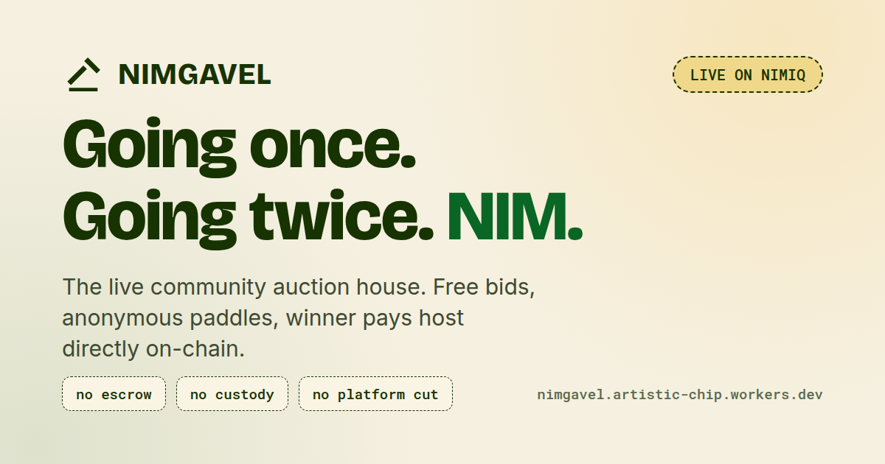
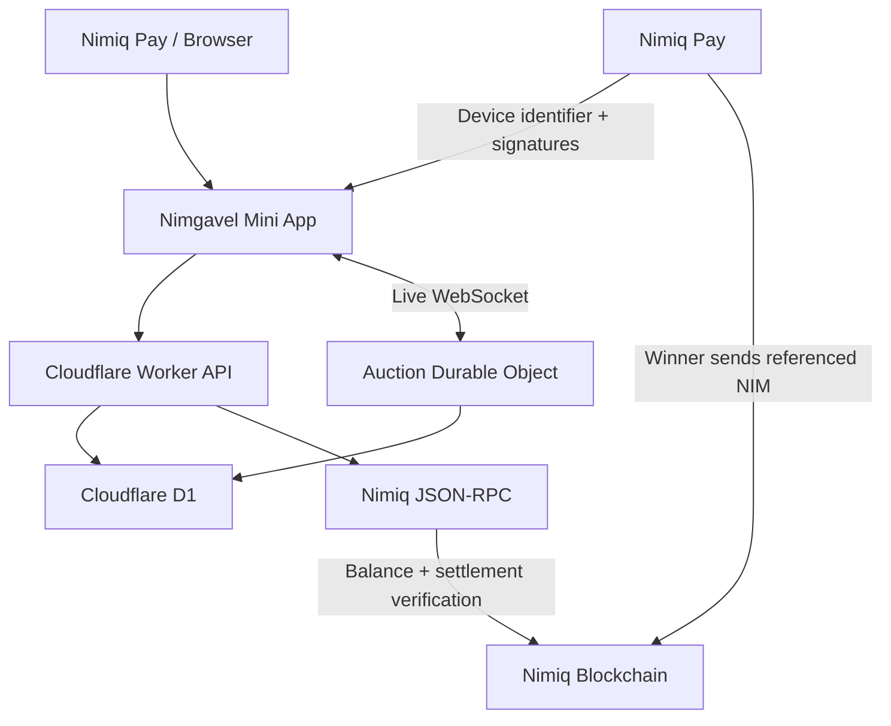

<p align="center">
  <a href="https://nimgavel.midelabs.xyz">
    
  </a>
</p>

<h1 align="center">Nimgavel</h1>

<h3 align="center">Going once. Going twice. NIM.</h3>

<p align="center">
  Live community auctions built natively for Nimiq Pay.
</p>

<p align="center">
  <a href="https://github.com/mystiquemide/nimgavel/actions/workflows/ci.yml">
    
  </a>
  <a href="https://nimgavel.midelabs.xyz">
    
  </a>
  <a href="https://www.nimiq.com/nimiq-pay">
    
  </a>
</p>

<p align="center">
  <a href="https://www.nimiq.com">
    
  </a>
  <a href="https://www.nimiq.com">
    
  </a>
  <a href="https://miniappscompetition.com">
    
  </a>
  <a href="./LICENSE">
    
  </a>
</p>

<p align="center">
  <a href="https://nimgavel.midelabs.xyz"><strong>Launch Nimgavel</strong></a>
  &nbsp;&nbsp;•&nbsp;&nbsp;
  <a href="https://nimgavel.midelabs.xyz/lobby">Auction Floor</a>
  &nbsp;&nbsp;•&nbsp;&nbsp;
  <a href="https://nimgavel.midelabs.xyz/how-it-works">How It Works</a>
  &nbsp;&nbsp;•&nbsp;&nbsp;
  <a href="https://nimgavel.midelabs.xyz/results">Results</a>
  &nbsp;&nbsp;•&nbsp;&nbsp;
  <a href="https://nimgavel.midelabs.xyz/leaderboard">Leaderboard</a>
</p>

<p align="center">
  <a href="https://nimgavel.midelabs.xyz">
    
  </a>
</p>

---

## Community auctions are easy to start but difficult to run fairly

Chat auctions work until several people start bidding at once. Then bid ordering becomes unclear, deadlines get disputed, last-second sniping becomes frustrating, withdrawn bids can destroy the audit trail, and payment proof becomes difficult to verify.

Nimgavel gives the auction one authoritative live room and one complete flow:

```text
create → bid → soft close → sell → pay → verify
```

There is no separate marketplace account, Nimgavel never takes custody of the user's NIM, and the platform does not charge a transaction fee.

Nimiq Pay handles wallet identity, signatures and the winner payment. Nimgavel handles the auction engine and verifies the resulting NIM settlement against Nimiq mainnet.

## Try Nimgavel

Production: https://nimgavel.midelabs.xyz

Network: **Nimiq mainnet**  
Settlement asset: **native NIM**  
Competition: **Nimiq Pay Mini Apps Competition, Cycle II**

The repository is currently private. Judge access can be granted as part of the final submission package.

## The auction loop

### 1. Create

A host creates a lot with a title, photo, description, starting bid, minimum increment, duration and fulfillment terms.

Hosts are prompted to explain the delivery or collection method, location or service-area context, expected timeframe, shipping responsibility or cost, and handoff details without exposing a private home address.

Auction creation requires a Nimiq Pay wallet signature. There is no separate Nimgavel username or password.

### 2. Bid

Bidders enter through Nimiq Pay and receive a pseudonymous paddle identity such as:

```text
Paddle #42 · Quiet Heron
```

The paddle comes from the Nimiq Pay Mini App device-identifier flow rather than a separate marketplace profile.

Before placing a first bid, the bidder must acknowledge the host's published fulfillment terms. The first bid also requires a Nimiq Pay authorization signature.

Nimgavel keeps a bounded set of NIM addresses shared by Nimiq Pay, binds that account set into the signed bidder proof, and checks those accounts individually on Nimiq mainnet. One account must independently cover the proposed bid. Balances are never added together across accounts.

Funds remain in the bidder's wallet until settlement. The balance check is an access guard, not a lock or escrow.

The multi-account balance flow is deployed and covered by CI. A real two-device mainnet run on September 18 confirmed that a funded Nimiq Pay bidder could pass the balance gate and place accepted bids from a separate mobile device. Broader device/account-layout coverage remains part of ongoing validation because earlier users reported false `0 NIM` results.

### 3. Soft close

A valid bid during the final 30 seconds resets the remaining time to 30 seconds.

The server owns the authoritative deadline, so a stale client cannot force a late bid through after the room has closed.

### 4. Sell

When the timer expires, the highest valid bid wins and the winning bid becomes locked.

A lot with no qualifying bids automatically becomes `passed`; the host does not need to manually expire it.

Bidders can withdraw eligible bids. Hosts can remove bids only with a public reason, and removed bids remain visible in the auction history.

### 5. Pay

Only the winning bidder receives the settlement action.

Nimiq Pay sends the exact winning amount directly from the winner's wallet to the host's wallet. Nimgavel never receives or holds the funds.

The payment includes an auction-specific reference:

```text
Nimgavel:<lotId>
```

Explicit wallet cancellation returns the winner safely to the payment flow, while uncertain payment outcomes stay in recovery mode to reduce double-payment risk.

### 6. Verify

A transaction hash alone is not accepted as proof.

Nimgavel checks the Nimiq network, recipient, exact amount, auction reference, execution result and confirmation state before marking settlement as verified.

Settlement moves through clear `pending`, `verified` and `rejected` states, and pending evidence is rechecked automatically.

## Nimiq Pay is load-bearing

Nimiq Pay is used throughout the product, not only at checkout.

| Scene | Nimiq Pay's role |
| --- | --- |
| Host signature | Signs the host authorization used to create and control the lot |
| Paddle identity | Provides the device-scoped identity used to issue a pseudonymous paddle |
| Bidder access | Shares the user's NIM account set and signs the first-bid authorization |
| Winner payment | Sends the native NIM payment directly to the host with the auction reference |
| Settlement verification | Produces the referenced transaction that Nimgavel verifies against Nimiq mainnet |

Nimgavel never receives the user's private key.

## Fair auction mechanics

### Ordered bidding

Each auction has one authoritative live room responsible for the current leader, amount, deadline and bid order.

### Balance-backed bidding

A bidder cannot raise the auction price unless at least one NIM address shared by Nimiq Pay has enough NIM for the proposed bid at that moment.

Shared accounts are checked individually. Nimgavel does not combine several smaller balances to satisfy one bid.

The balance is not locked, so this prevents zero-balance price inflation at bid time but does not guarantee that the funds remain available until settlement.

### Minimum increments

Every bid must satisfy the host's configured minimum increment.

### Server-authoritative deadlines

The server decides whether bidding is still open.

### Transparent removals

Withdrawn and host-removed bids remain in history rather than disappearing silently.

If the current leader is removed, the room recalculates the valid leader and preserves response time for the remaining bidders.

### Locked winner

The winning bid cannot be withdrawn after the gavel falls.

## Architecture



Frontend: Vanilla JavaScript + Vite  
API/runtime: Cloudflare Workers  
Live auction state: Durable Objects + WebSockets  
Persistence: Cloudflare D1  
Wallet integration: `@nimiq/mini-app-sdk`  
Transaction parsing: `@nimiq/core`

Nimgavel uses no custom smart contract and no custodial platform wallet.

See [`docs/ARCHITECTURE.md`](docs/ARCHITECTURE.md) for the deeper protocol and API model.

## Product surfaces

| Surface | What it does |
| --- | --- |
| Home | Introduces Nimgavel, exposes app-first shortcuts, and lets users return to joined or recently viewed auctions |
| Auction Floor | Browse live, upcoming and completed lots |
| Auction Room | Timer, leader, bids, removals, fulfillment and settlement |
| Host | Create and control an auction, with a direct mobile shortcut back to your auctions |
| Results Ledger | Completed auctions and settlement state |
| Leaderboard | Auction activity and winning history |
| How It Works | Auction lifecycle and trust boundaries |
| Privacy & Terms | Product responsibilities and limitations |

A normal browser can browse and spectate. Hosting, authenticated bidding and wallet settlement are handled inside Nimiq Pay.

## Used by early users on Nimiq mainnet

Early users have created auction rooms, joined auctions on mobile, connected Nimiq Pay, navigated the product and exercised the mainnet flow.

The labels below represent separate users or usage sessions. Names and handles are withheld from the public README.

> “The UI is smooth, there’s a beginner guide, and it’s so easy to navigate.”  
> — **User 1 · Mobile mainnet user**

> “Bidding on an open auction item was seamless.”  
> — **User 2 · Auction participant**

> “Basically, your own mini auction house, powered by Nimiq.”  
> — **User 3 · First-time Nimgavel user**

> “Overall user experience on mobile was okay. I didn’t need an explainer to understand.”  
> — **User 4 · Mobile Nimiq Pay user**

A separate user rated their experience **95.9/100**, specifically praising the UI, brand consistency and working navigation. This is one user's rating, not an aggregate product score.

## User feedback changed the product

| User | What they noticed | What changed |
| --- | --- | --- |
| **User 1** | The mobile experience was easy to understand and the beginner guidance helped | Kept onboarding lightweight and preserved the direct navigation into auctions |
| **User 2** | Bidding on an open auction felt seamless | Kept bidding off-chain and reduced unnecessary friction around normal bid interactions |
| **User 3** | The product immediately made sense as a personal/community auction house powered by Nimiq | Kept the product focused on the complete auction loop instead of expanding into unrelated marketplace features |
| **User 4** | Mobile UX was understandable without an explainer, but bidder access reported `0 NIM` despite a funded wallet | Hardened mainnet RPC parsing, added retry logic, and changed bidder authorization to check the bounded Nimiq Pay account set instead of one assumed address. Real-device verification is still ongoing |
| **User 5** | Recent hammer results moved while they were reading, Results/Auction Floor loaded slowly, and they wanted clearer guidance on what can be auctioned | Reduced disruptive result refreshes, stopped embedding large base64 images in list responses, and clarified auctionable items and empty-auction behavior |
| **User 6** | Wanted delivery/collection terms agreed before bidding and asked how to complain if an item arrives late or never arrives | Added fulfillment terms before bidding, explicit bidder acknowledgement, and expanded the roadmap for delivery status and complaints |
| **User 7** | Asked what assurance a buyer has after paying and compared the experience to Amazon | Clarified that Nimgavel verifies auction/payment evidence but does not currently guarantee physical delivery, provide escrow or arbitrate disputes |
| **User 8** | Said hosted auctions were hard to find quickly on mobile and suggested a My Auctions button in the sidebar | Added a My Auctions shortcut to the mobile drawer that jumps directly to the user's auction section |
| **User 9** | Said someone discovering Nimgavel inside Nimiq Pay first would struggle to find their way back to auctions without website context | Added an app-first home section with My Auctions, Joined Auctions and Recently Viewed, plus a Recent & Joined shortcut in the mobile drawer. Room visits and successful bid participation are remembered locally for direct return links |
| **User 10** | Opened an auction from Nimiq Pay but Nimgavel still behaved like a normal browser and asked them to open Nimiq Pay again | Hardened wallet-context recovery so both supported Nimiq Pay bridge signals can trigger provider fallback and delayed reconnection instead of leaving the room in spectator mode |
| **User 11** | Liked the Nimiq Pay-centered auction flow and found auction creation easy, but said the landing page took too long to explain the product, the mobile preview appeared too late, and signing/publishing states were unclear | Tightened the hero copy, moved a clear auction preview before the mobile signing action, and added explicit creation stages for preparing, wallet confirmation, publishing and completion |
| **User 12** | Said wallet connection could sit on “Connecting your wallet…” for too long across repeated mobile opens, although the direct auction room link worked correctly afterward | Changed wallet startup to use an already-injected Nimiq Pay provider immediately instead of waiting for SDK initialization to fail first, reducing avoidable connection delay |
| **User 13** | Said the landing page felt slow on first open and showed a black screen for a few seconds before Nimgavel appeared | Added an immediate light-theme first paint with Nimgavel's canvas/background and a lightweight boot shell, and made external font loading non-blocking so slow fonts cannot delay the initial product view |

This feedback came from real product usage and has directly shaped the current flow.

## Current trust boundary

Nimgavel can prove much more about the auction and NIM payment than it can currently prove about real-world delivery.

### What Nimgavel establishes

- authoritative auction state
- bid and removal history
- the winning paddle
- published fulfillment terms
- bidder acknowledgement of those terms
- a balance gate at bid time
- matching NIM settlement evidence

### What Nimgavel does not guarantee

- custody of buyer or seller funds
- locked bidder funds between bidding and settlement
- physical delivery
- physical item authenticity
- escrow
- dispute arbitration
- the real-world identity of a bidder or seller

A verified NIM payment proves that the matching payment occurred under the configured RPC trust assumption. It does not prove that a seller later delivered an item or that a physical item is authentic.

## Roadmap

The next product work is focused on making repeat auctions dependable and improving the settlement-to-delivery lifecycle.

Near-term priorities include wallet-signed host recovery, cancellation for auctions that have not started, a clear unpaid-winner state, better native-device coverage, private host/winner coordination, delivery status, tracking references, delivery confirmation and a structured complaint history.

Longer-term settlement protection may explore refundable bid bonds, stronger wallet payment commitments, or escrow/HTLC-style designs, but only after dedicated protocol and security review.

See [`ROADMAP.md`](ROADMAP.md) for the full roadmap.

## Judge evidence

The strongest submission story is one complete auction, not a feature checklist:

```text
host signs
   ↓
bidder gets a paddle
   ↓
bidder authorizes the shared NIM account set
   ↓
live bidding
   ↓
soft close
   ↓
winner selected
   ↓
winner pays in Nimiq Pay
   ↓
Nimgavel verifies settlement
```

The judge bundle is built around the live app, repository access, architecture, automated tests, real two-device auction evidence, bid-removal evidence, and a genuine verified mainnet NIM payment.

### Mainnet settlement proof

A real two-device auction completed from live bidding through winner payment and Nimgavel settlement verification on September 18, 2026.

- Winning paddle: **#12 · Calm Finch**
- Winning bid: **3 NIM**
- Payment: winner → host through Nimiq Pay
- Transaction reference: `Nimgavel:<lotId>`
- Verified transaction: [`0c0901c81a0db2fb792da6107a690b74270dc391b55fb12b980d938d4465aa74`](https://nimiq.watch/#0c0901c81a0db2fb792da6107a690b74270dc391b55fb12b980d938d4465aa74)
- Additional verified mainnet settlement: [`be8486710831dad0c30d5324249cf5f48325bd5cf6cb4bf0280cd6c33dc8bcbe`](https://nimiq.watch/#be8486710831dad0c30d5324249cf5f48325bd5cf6cb4bf0280cd6c33dc8bcbe)

The same run also confirmed separate host and bidder paddles, live WebSocket synchronization, balance-backed bidding, winner locking and the winner-only payment surface. Soft close is enforced by the authoritative auction room and covered by the automated suite.

## Testing and CI

GitHub Actions builds the frontend, starts a local Worker, applies D1 migrations, runs the automated suite, performs a Worker deploy dry-run, runs the dependency audit and checks the production bundle for dev-only leakage.

Automated coverage includes signed hosting, authenticated bidding, strict Nimiq RPC balance parsing and retry behavior, multi-account bidder proofs, minimum increments, soft close, bid removal, settlement verification, transaction parsing, authorization failures, database failures and invalid payment evidence.

RPC fixtures used locally simulate blockchain responses. They are test tools, not real payment evidence.

Run the same core checks locally with:

```sh
npm test
npm run build:web
npm run worker:check
npm audit
```

## Competition

Nimgavel is built for the **Nimiq Pay Mini Apps Competition, Cycle II**.

The core competition question is simple:

> Can Nimiq Pay power a fair live auction from creation all the way to verified payment?

Nimgavel answers that with the complete working loop above, with Nimiq Pay carrying identity, authorization and payment rather than appearing only at checkout.

## Developer appendix

### Tech stack

| Layer | Technology |
| --- | --- |
| Mini App | Vanilla JavaScript + Vite |
| Nimiq | `@nimiq/mini-app-sdk`, `@nimiq/core` |
| Runtime | Cloudflare Workers |
| Live rooms | Durable Objects + WebSockets |
| Database | Cloudflare D1 |
| Payments | Native NIM transfers through Nimiq Pay |
| Verification | Nimiq JSON-RPC |
| QR | `qrcode` |
| Testing | Node.js test runner + GitHub Actions |
| License | MIT |

### Run locally

Requirements:

- Node.js 22.20+
- Cloudflare Wrangler
- a private `NIMGAVEL_SECRET` of at least 32 characters

Create `.dev.vars`:

```env
NIMGAVEL_SECRET=replace-with-a-random-secret
NIMIQ_RPC_URL=http://127.0.0.1:8899
NIMIQ_NETWORK=testnet
```

Install and start:

```sh
npm ci
npm run build:web
npm run db:migrate:local
npm run dev:worker -- --local --test-scheduled
```

Open `http://localhost:8799`.

For frontend hot reload:

```sh
npm run dev:web
```

### Documentation

- [`docs/ARCHITECTURE.md`](docs/ARCHITECTURE.md) — architecture, auction state, API, WebSockets and payment verification
- [`ROADMAP.md`](ROADMAP.md) — planned product development and trust work
- [`docs/DEPLOY.md`](docs/DEPLOY.md) — deployment and environment setup
- [`docs/CREDITS.md`](docs/CREDITS.md) — third-party visual credits

## Links

- **Live app:** https://nimgavel.midelabs.xyz
- **Auction floor:** https://nimgavel.midelabs.xyz/lobby
- **Results:** https://nimgavel.midelabs.xyz/results
- **Leaderboard:** https://nimgavel.midelabs.xyz/leaderboard
- **How it works:** https://nimgavel.midelabs.xyz/how-it-works
- **Nimiq Pay:** https://www.nimiq.com/nimiq-pay

## License

[MIT](LICENSE). Third-party libraries and photography retain their own licenses. See [`docs/CREDITS.md`](docs/CREDITS.md).
