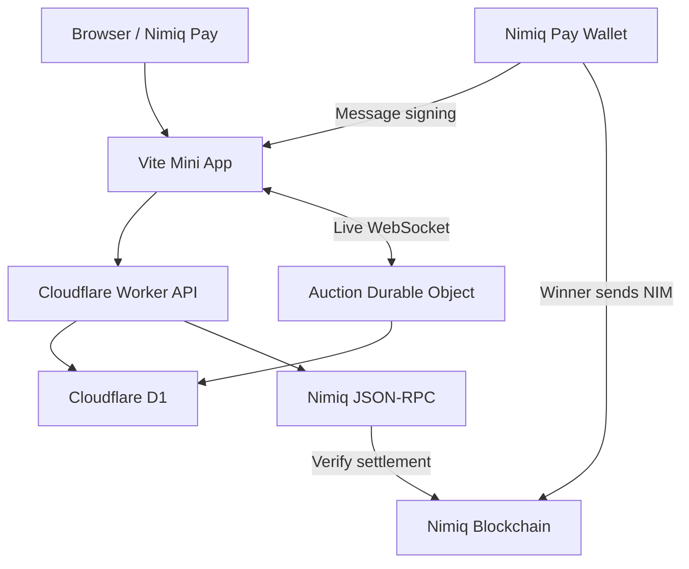

<p align="center">
  <a href="https://nimgavel.artistic-chip.workers.dev">
    
  </a>
</p>

<h1 align="center">Nimgavel</h1>

<h3 align="center">Going once. Going twice. NIM.</h3>

<p align="center">
  Live community auctions built natively for Nimiq Pay.
</p>

<p align="center">
  <a href="https://github.com/mystiquemide/nimgavel/actions/workflows/ci.yml">
    
  </a>
  <a href="https://nimgavel.artistic-chip.workers.dev">
    
  </a>
  <a href="https://www.nimiq.com/nimiq-pay">
    
  </a>
</p>

<p align="center">
  <a href="https://www.nimiq.com">
    
  </a>
  <a href="https://miniappscompetition.com">
    
  </a>
  <a href="./LICENSE">
    
  </a>
</p>

<p align="center">
  <a href="https://nimgavel.artistic-chip.workers.dev"><strong>Launch Nimgavel</strong></a>
  &nbsp;&nbsp;•&nbsp;&nbsp;
  <a href="https://nimgavel.artistic-chip.workers.dev/lobby">Auction Floor</a>
  &nbsp;&nbsp;•&nbsp;&nbsp;
  <a href="https://nimgavel.artistic-chip.workers.dev/how-it-works">How It Works</a>
  &nbsp;&nbsp;•&nbsp;&nbsp;
  <a href="https://nimgavel.artistic-chip.workers.dev/results">Results</a>
  &nbsp;&nbsp;•&nbsp;&nbsp;
  <a href="https://nimgavel.artistic-chip.workers.dev/leaderboard">Leaderboard</a>
</p>

<p align="center">
  <a href="https://nimgavel.artistic-chip.workers.dev">
    
  </a>
</p>

---

## Live auctions, directly inside the wallet

Nimgavel is a live community auction house built inside **Nimiq Pay**.

Hosts can list an item, open a live auction room and receive bids in real time. Bidders join with a pseudonymous paddle, compete without paying for every bid, and the winner settles directly with the host in **NIM**.

**No marketplace account. No platform custody. No platform transaction fee.**

Nimiq Pay handles the wallet, signatures and payment. Nimgavel handles the auction.

## Why Nimgavel exists

Running a small community auction online is still awkward.

Traditional platforms introduce accounts, marketplace fees, payment processors and custody. Chat-based auctions are easier to start, but bids become hard to order, closing times can be disputed, and payment proof is difficult to verify.

Nimgavel turns the full process into one clear loop:

```text
list → bid → close → pay → verify
```

The goal is to make the blockchain useful without making users think about blockchain mechanics at every step.

## Who it is for

Nimgavel is designed for communities, creators, collectors and event organizers that want to run lightweight live auctions without building or joining a full marketplace.

Potential uses include:

- community merchandise auctions
- creator drops
- digital and physical collectibles
- charity and fundraising auctions
- limited-edition community items
- private community events
- recurring club or organizer auctions

## How an auction works

### 1. Host a lot

Open Nimgavel inside Nimiq Pay and create an auction with an item title, description, photograph, starting price, minimum increment and duration.

The host signs a one-time wallet challenge. There is no separate Nimgavel account or password.

### 2. Join with a paddle

Participants receive a pseudonymous, device-scoped paddle identity such as:

```text
Paddle #42 · Quiet Heron
```

This keeps the auction interface simple while avoiding another signup flow.

### 3. Bid in real time

Auction rooms update live over WebSockets. Every valid bid is ordered by the authoritative room state and broadcast to connected participants.

Bidding itself does not send an on-chain transaction, so users can raise their paddle without paying a network fee for each bid.

### 4. Soft close prevents sniping

A valid bid during the final 30 seconds resets the remaining time to 30 seconds.

The auction closes only when bidding actually stops, giving other participants a fair chance to respond.

### 5. Winner pays the host directly

When the gavel falls, only the winning paddle receives the payment action.

Nimiq Pay sends the exact winning amount directly from the winner's wallet to the host's wallet. Nimgavel never receives or holds the funds.

### 6. Nimgavel verifies settlement

A transaction hash alone is not treated as proof of payment.

Nimgavel checks the transaction against the auction, including:

- transaction hash
- Nimiq network
- recipient
- exact amount
- auction reference
- successful execution
- required confirmations

Receipts move through explicit states such as `pending`, `verified` or `rejected`, and pending payments are rechecked automatically.

## Product surfaces

| Surface | What it does |
| --- | --- |
| **Home** | Introduces Nimgavel and directs users into the auction experience |
| **Auction Floor** | Browse live, upcoming and completed auction lots |
| **Auction Room** | Follow the timer, current leader, bid history and room state in real time |
| **Host** | Create, share and control an auction |
| **Results Ledger** | Review completed auctions and settlement status |
| **Leaderboard** | See auction activity and winning history |
| **How It Works** | Understand the auction lifecycle in plain language |
| **Privacy & Terms** | Read the product's trust boundaries and user responsibilities |

A normal browser can be used to browse and spectate. Hosting, authenticated bidding and wallet settlement are intentionally handled inside Nimiq Pay.

## What Nimgavel contains

The current product includes:

- wallet-signed auction creation
- image-backed auction lots
- device-scoped bidder paddles
- real-time WebSocket auction rooms
- server-authoritative bid ordering
- configurable starting prices and increments
- soft-close anti-sniping rules
- bidder withdrawal for mistaken bids
- host moderation with required public reasons
- visible bid-removal history
- direct winner-to-host NIM settlement
- transaction-reference binding
- on-chain payment verification
- automatic settlement rechecks
- public auction results
- leaderboard and auction history
- QR and share flows
- browser spectator mode
- Nimiq Pay wallet, loading, cancellation and recovery states
- automated functional and security regression tests

## Why Nimiq Pay is core

Nimiq integration is part of the product lifecycle, not an optional checkout button at the end.

Nimgavel uses `@nimiq/mini-app-sdk` for wallet-aware Mini App functionality including wallet accounts, message signing, device-scoped paddles and NIM transfers. `@nimiq/core` is used to parse wallet transaction results.

The host's wallet signature authorizes auction creation and control. The winner's native NIM payment settles the auction. Nimiq Pay owns private-key handling and transaction approval throughout the flow.

Nimgavel never receives the user's private key.

## Fair auction mechanics

Live auctions need stronger rules than a normal payment page.

### Ordered bidding

Each auction has one authoritative live room responsible for the current leader, amount, deadline and bid order.

### Minimum increments

A bid must beat the current amount by at least the host's configured minimum increment.

### Server-authoritative deadlines

The server decides whether the room is still open. A stale client or delayed timer cannot submit a valid bid after the authoritative deadline.

### Transparent removals

Bidders can withdraw their own bids. Hosts can remove bids only with a public reason, and removed bids remain in the room's removal history instead of silently disappearing.

If a live leader is removed, the room recalculates the highest valid bid and guarantees bidders enough time to respond.

### Locked winner

Once the auction closes, the winning bid is locked and cannot be removed.

## Architecture



### Frontend

Vanilla JavaScript with Vite powers the auction floor, rooms, hosting flow, results, leaderboard, spectator states and wallet recovery UI.

### API

A Cloudflare Worker handles REST validation, authorization, lot management and settlement verification.

### Live auction engine

Each auction uses its own Cloudflare Durable Object for ordered bids, WebSockets, persistent room state and close alarms.

### Persistence

Cloudflare D1 stores lots, paddles, bid history, challenges, removal history and receipt verification state.

### Nimiq

Nimiq Pay handles signing and native NIM payment. A configured Nimiq JSON-RPC provider is used to verify settlement evidence.

Nimgavel uses no custom smart contracts and operates no custodial payment wallet.

For the deeper protocol and API model, see [`docs/ARCHITECTURE.md`](docs/ARCHITECTURE.md).

## Reliability and failure handling

A live auction cannot assume every network request succeeds on the first attempt.

Nimgavel explicitly handles cases including:

- wallet connection and cancellation states
- reconnecting auction-room clients
- expired authorization
- invalid bid increments
- bids arriving after close
- delayed close alarms
- database write failures
- invalid or incomplete payment evidence
- unavailable RPC responses
- rejected settlement verification
- retrying pending payment checks

Auction finalization is written idempotently, and settlement verification stays separate from merely recording a transaction hash.

## Testing and CI

The GitHub Actions workflow builds the frontend, starts a local Worker, applies D1 migrations, runs the full test suite, performs a Worker deploy dry-run, runs the dependency audit and checks the production bundle for dev-only leakage.

Run the same core checks locally with:

```sh
npm test
npm run build:web
npm run worker:check
npm audit
```

Tests cover signed hosting, authenticated bidding, minimum increments, soft closes, settlement checks, transaction parsing and failure recovery.

[`test/security-regressions.test.js`](test/security-regressions.test.js) also covers authorization bypasses, expired auctions, D1 outages and invalid payment evidence.

RPC fixtures used by the local tests simulate blockchain responses. They are testing tools, not real payment evidence.

## What we built for the Nimiq Mini Apps Competition

Nimgavel started with a simple question:

> Can Nimiq Pay power a real-time economic experience instead of only a one-time payment screen?

For this competition, we built the complete auction loop from listing through bidding and final settlement verification.

The goal was not to create a mock auction interface. We wanted every important transition to exist as part of one working product:

```text
create → authorize → bid → close → settle → verify → publish result
```

This turns NIM into the settlement layer for a live social-commerce experience inside Nimiq Pay.

## Why people would come back

Auctions create a natural repeat loop.

A creator can launch another item. A community can run another drop. An organizer can host another event. Bidders can return for new lots, inspect previous results and build an auction history.

```text
new lot
  ↓
community joins
  ↓
live bidding
  ↓
settlement
  ↓
public result
  ↓
next auction
```

The longer-term opportunity is to make Nimgavel a reusable auction primitive for Nimiq communities and organizers.

## Roadmap

Nimgavel's next stage is focused on making repeat auctions dependable before expanding into a broader marketplace.

### Near term

- wallet-signed host-control recovery
- cancellation for auctions that have not started
- stronger native-device coverage
- clearer bidder identity boundaries
- improved monitoring and operational resilience

### Community organizer tools

Once repeat organizers demonstrate demand:

- organizer pages
- multi-lot auction events
- upcoming auction schedules
- opt-in reminders
- settlement and receipt exports

### Trust and marketplace tooling

Future work can include:

- clearer listing provenance
- delivery information
- reporting tools
- moderation systems
- reputation based on meaningful completed activity

Wallet ownership and seller reputation will remain separate concepts.

### Sustainable business model

Basic community auctions should remain easy to access.

Potential paid organizer features include branded auction events, team controls, reporting and advanced event management. Transaction fees, escrow or delivery-linked settlement would only be considered after real user demand, legal review and dedicated security work.

See [`ROADMAP.md`](ROADMAP.md) for the full product roadmap.

## Trust model and current limitations

Nimgavel deliberately keeps the financial model simple.

### Nimgavel does

- run the live auction
- maintain authoritative bid state
- determine the winning paddle
- request the correct NIM payment
- verify settlement evidence
- publish auction results

### Nimgavel does not

- custody buyer or seller funds
- guarantee delivery
- authenticate physical items
- provide escrow
- guarantee the real-world identity of a bidder
- hold private keys

Additional current boundaries:

- paddles identify devices, not unique people or verified wallets
- host-control tokens currently expire after 24 hours and do not yet have a recovery flow
- payment verification trusts the configured RPC provider
- public lists are intentionally bounded rather than unbounded feeds
- local demo fixtures are synthetic and never count as evidence of real usage

Payment verification proves that a matching NIM transaction occurred under the configured RPC trust assumption. It does not prove that a seller delivered an item or that a physical item is authentic.

## Run locally

Requirements:

- Node.js 22.20+
- Cloudflare Wrangler
- a private `NIMGAVEL_SECRET` of at least 32 characters

Create `.dev.vars`:

```env
NIMGAVEL_SECRET=replace-with-a-random-secret
NIMIQ_RPC_URL=http://127.0.0.1:8899
```

Install and start:

```sh
npm ci
npm run build:web
npm run db:migrate:local
npm run dev:worker -- --local --test-scheduled
```

Open `http://localhost:8799`.

For frontend hot reload, run:

```sh
npm run dev:web
```

The Vite development server proxies API and WebSocket traffic to the local Worker.

## Tech stack

| Layer | Technology |
| --- | --- |
| Mini App | Vanilla JavaScript + Vite |
| Nimiq | `@nimiq/mini-app-sdk`, `@nimiq/core` |
| Runtime | Cloudflare Workers |
| Live rooms | Cloudflare Durable Objects + WebSockets |
| Database | Cloudflare D1 |
| Payments | Native NIM transfers through Nimiq Pay |
| Verification | Nimiq JSON-RPC |
| QR | `qrcode` |
| Testing | Node.js test runner + GitHub Actions |
| License | MIT |

## Documentation

- [`docs/ARCHITECTURE.md`](docs/ARCHITECTURE.md) — architecture, auction state, API, WebSockets and payment verification
- [`docs/DEPLOY.md`](docs/DEPLOY.md) — deployment and environment setup
- [`ROADMAP.md`](ROADMAP.md) — planned product development
- [`docs/CREDITS.md`](docs/CREDITS.md) — third-party visual credits

## Competition

Nimgavel is built for the **Nimiq Pay Mini Apps Competition, Cycle II**.

The project is open source under the MIT License and built around the Nimiq Pay Mini Apps Framework.

Our contribution to the ecosystem is simple:

> **Make NIM useful inside a live social-commerce experience.**

Instead of leaving the wallet to visit an auction platform, the auction comes to the wallet.

## Links

- **Live app:** https://nimgavel.artistic-chip.workers.dev
- **Auction floor:** https://nimgavel.artistic-chip.workers.dev/lobby
- **Results:** https://nimgavel.artistic-chip.workers.dev/results
- **Leaderboard:** https://nimgavel.artistic-chip.workers.dev/leaderboard
- **How it works:** https://nimgavel.artistic-chip.workers.dev/how-it-works
- **Nimiq Pay:** https://www.nimiq.com/nimiq-pay

## License

[MIT](LICENSE). Third-party libraries and photography retain their own licenses. See [`docs/CREDITS.md`](docs/CREDITS.md).